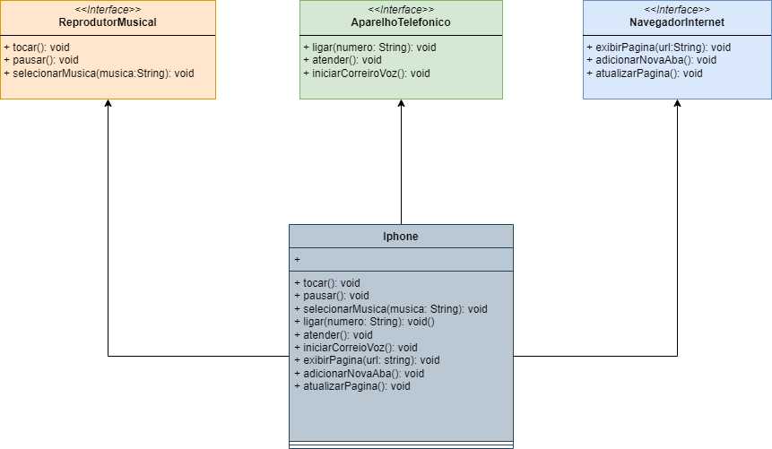

# Desafio DIO Java Basico relacionado ao bootcamp Desenvolvimento Java com IA

## O desafio proposto foi
### Modelagem e Diagramação de um Componente iPhone
Neste desafio, você será responsável por modelar e diagramar a representação UML do componente iPhone, abrangendo suas funcionalidades como Reprodutor Musical, Aparelho Telefônico e Navegador na Internet.

### Contexto
Com base no vídeo de lançamento do iPhone de 2007 (link abaixo), você deve elaborar a diagramação das classes e interfaces utilizando uma ferramenta UML de sua preferência. Em seguida, implemente as classes e interfaces no formato de arquivos .java.

Funcionalidades a Modelar
Reprodutor Musical
Métodos: tocar(), pausar(), selecionarMusica(String musica)
Aparelho Telefônico
Métodos: ligar(String numero), atender(), iniciarCorreioVoz()
Navegador na Internet
Métodos: exibirPagina(String url), adicionarNovaAba(), atualizarPagina()
Objetivo
Criar um diagrama UML que represente as funcionalidades descritas acima.
Implementar as classes e interfaces correspondentes em Java (Opcional).

---
Segue a imagem da UML complea e na pasta desafio tem as classes com as interfaces.

